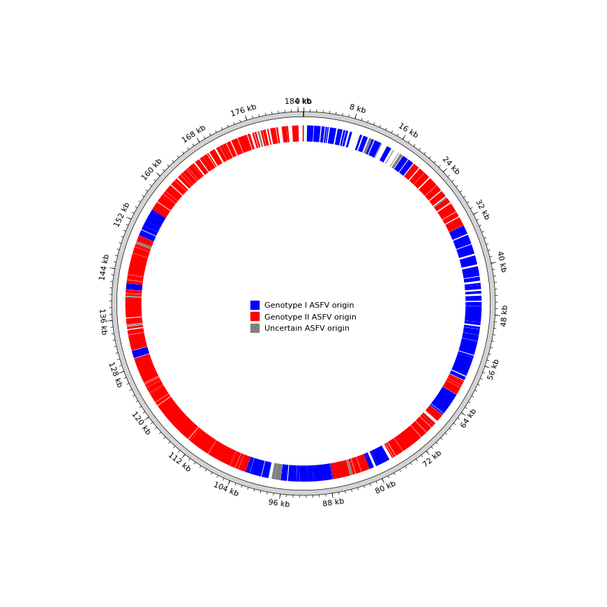

# Example Projects
## Docker
Using Docker is more convenient, eliminating the troublesome of installation steps. So we provide a docker image:
```bash
docker pull osvolo/anasfv:latest
docker container run -it osvolo/anasfv /bin/bash
```	 
## Prepare your data
The test files are already included in the docker container. If you don't use Docker, you can get it by the following method.

① ONT reads (fasta or fastq file). You can download our test file using the following command.
```bash
wget https://github.com/lrslab/anasfv/releases/download/test_data.fasta/test_data.fasta
```

② Other ASFV genomes. These genomes are used for mapping assembly and tree building. You can directly use the single_fasta directory in this project, which contains 406 downloaded ASFV genomes.
```bash
git clone https://github.com/nimua/single_fasta.git
```
Or you can run download_asfv_genome.py, which will create a single_fasta directory in the working directory and download all the latest ASFV genomes on NCBI to the single_fasta directory.
```bash
download_asfv_genome.py
```

## Task 1 (Assembling a genome):
Using ONT reads of PCR-amplified ASFV to assemble a genome. (This task is optional. If you have already obtained an assembled genome by other methods, you can apply Tasks 2, 3, and 4)
```bash
mapping_assembly.py -p 4 -r single_fasta -i test_data.fasta -o genome.fasta --medaka r941_min_high_g303
```

Polish the homopolymers (Select the closest non-ONT sequenced ASFV genome as the reference genome in NCBI by blastn). Using MN194591.1.fasta as an example:
```bash
polish_asfv.py -i single_fasta/MN194591.1.fasta -r single_fasta/OR180113.1.fasta -m R9.4.pkl
```

## Task 2 (Genome completeness evaluation):
We only established consensus gene sets for genotype I and genotype II. Using -c to assign consensus gene sets.
Using MN194591.1.fasta as an example：
```bash
completeness.py single_fasta/MN194591.1.fasta -c II > MN194591.1_completeness.tsv
```
Example of result:

| file_name |	size |	prodigal_gene_num |	with_MGF |	without_MGF |
| --------------  | ----- | -------- | -------- | -------- |
| MN194591.1.fasta |	191911 |	242 |	C:57.43%[D:0.0%],F:39.19%,M:3.38%,n:148 |	C:51.3%[D:0.0%],F:44.35%,M:4.35%,n:115 |


## Task 3 (Recombination test):
Using OQ504956.1 as example：
```bash
recombination_test.py single_fasta/OQ504956.1.fasta > OQ504956.1_recombination_test.tsv
```
Recombination plot of OQ504956.1:


## Task 4 (Constructing a tree):
Using all genome files from "./single_fasta" and get a final file "tree.nwk" in Newick format
```bash
make_tree.py -f single_fasta -o tree
```

Phylogenetic tree using [single_fasta](https://github.com/nimua/single_fasta.git) (visualized by iTOL):

