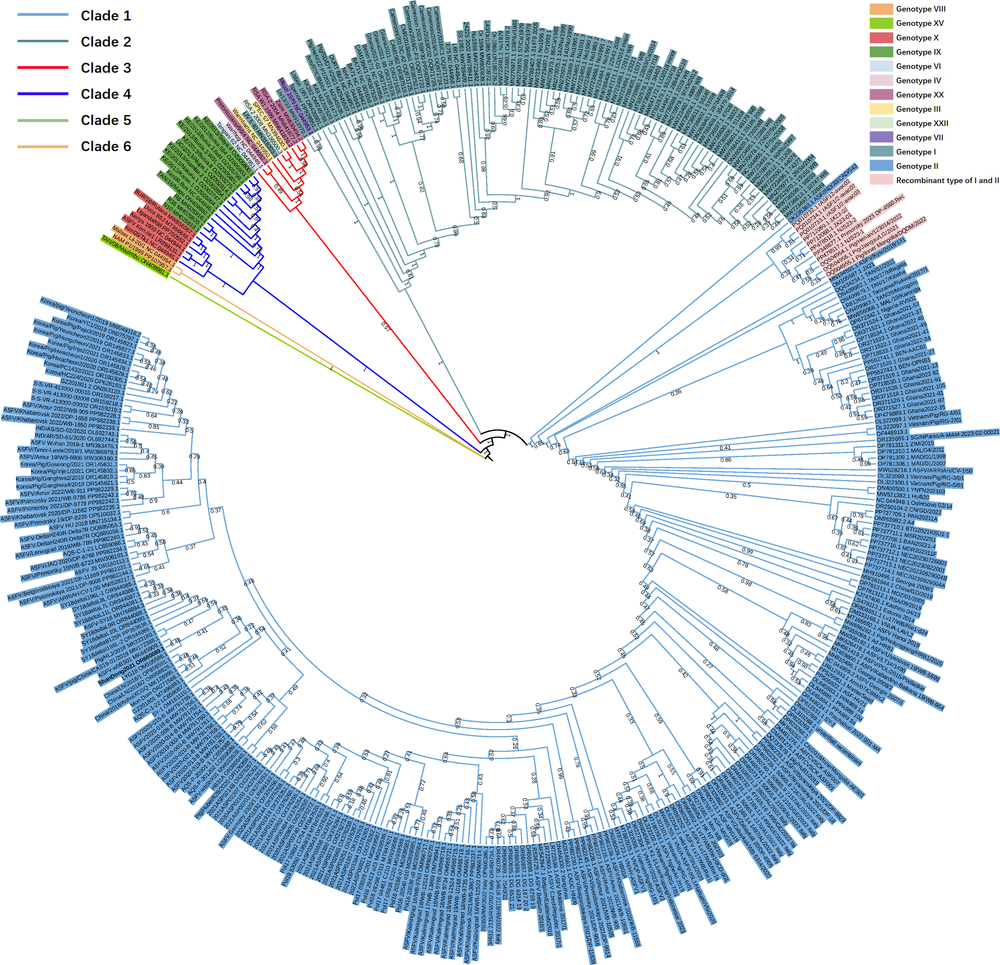

## ANASFV
The **ANASFV** project focuses on analyzing nanopore-sequenced data of PCR-amplified African Swine Fever Virus (ASFV). It consists of 4 tasks:

Task 1: Using ONT reads of PCR-amplified ASFV to assemble a genome. (This task is optional. If you have already obtained an assembled genome by other methods, you can apply Tasks 2, 3, and 4)

Task 2: Analyzing the completeness of the assembled ASFV genome.

Task 3: Checking for any evidence of recombination between genotypes I and II.

Task 4: Constructing a phylogenetic tree.

Full documentation is available at [read the docs](https://anasfv.readthedocs.io/en/latest/).


<a href="https://pypi.python.org/pypi/anasfv" rel="pypi"> </a>


## Docker:
Using Docker is more convenient, eliminating the troublesome of installation steps.
```
docker pull osvolo/anasfv:latest
docker container run -it osvolo/anasfv /bin/bash
```
## Installation:
Requirements：
1. python: 3.11 (tested). Most Python 3 versions should work.
2. Software versions tested:
 	 \- Samtools: 1.17
  	 \- BEDTools: 2.26.0
  	 \- Minimap2: 2.17-r941
  	 \- Prodigal: 2.6.3
  	 \- Exonerate: 2.4.0
  	 \- blast: 2.12.0
  	 \- MUSCLE: 5.1
   	 \- Medaka: 1.11.3
  	 \- Homopolish: 0.4.1
  	 \- uDance: 1.6.4
 
Install requirements in conda environment and install ANASFV via PyPI:
```
conda create -n anasfv -c conda-forge python=3.11 -y
conda activate anasfv
conda install -c bioconda samtools bedtools minimap2 prodigal exonerate blast muscle -y
pip install anasfv
```

If you need to use medaka and homopolish for polish, you need to create their corresponding conda environments and install them, because there will be some conflicts if you install them directly in the ANASFV runtime environment.
```
conda create -n medaka -c bioconda -c conda-forge medaka=1.11.3 -y
conda config --set channel_priority flexible
conda create -n homopolish -c conda-forge -c bioconda -c defaults more-itertools=8.4.0 homopolish=0.4.1 -y
```

The tree building process uses uDance. For uDance installation refer to [uDance](https://github.com/balabanmetin/uDance)

## A Quick Example:
### Prepare data：
1. Test data: Downloads test_data.fasta to the working directory
```
wget https://github.com/lrslab/anasfv/releases/download/test_data.fasta/test_data.fasta
```
2. Other ASFV genomes. These genomes are used for mapping assembly and tree building. You can directly use the [single_fasta](https://github.com/nimua/single_fasta.git), which contains 406 downloaded ASFV genomes, or you can run download_asfv_genome.py, which will create a directory name "single_fasta" and download all the latest ASFV genomes on NCBI to the directory.
```
download_asfv_genome.py
```
### Task 1 (Assembling a genome):
Perform mapping assembly and preliminary polish (Finding closest genome from "./single_fasta" as a reference to perform mapping assebly). 
Using [test_data.fasta](https://github.com/lrslab/anasfv/releases/download/test_data.fasta/test_data.fasta) as example:
```
mapping_assembly.py -p 4 -r single_fasta -i test_data.fasta -o genome.fasta --medaka r941_min_high_g303
```

Polish the homopolymers (Select the closest non-ONT sequenced ASFV genome as the reference genome in NCBI by blastn).
Using MN194591.1.fasta as an example:
```
polish_asfv.py -i single_fasta/MN194591.1.fasta -r single_fasta/OR180113.1.fasta -m R9.4.pkl
```

### Task 2 (Genome completeness evaluation):
We only established consensus gene sets for genotype I and genotype II. Using -c to assign consensus gene sets.
Using MN194591.1.fasta as an example：
```
completeness.py single_fasta/MN194591.1.fasta -c II > MN194591.1_completeness.tsv
```
Example of result:

| file_name |	size |	prodigal_gene_num |	with_MGF |	without_MGF |
| --------------  | ----- | -------- | -------- | -------- |
| MN194591.1.fasta |	191911 |	242 |	C:57.43%[D:0.0%],F:39.19%,M:3.38%,n:148 |	C:51.3%[D:0.0%],F:44.35%,M:4.35%,n:115 |


### Task 3 (Recombination test):
Checking for any evidence of recombination between genotypes I and II.
Using OQ504956.1 as an example：
```
recombination_test.py single_fasta/OQ504956.1.fasta > OQ504956.1_recombination_test.tsv
recombination_plot.py OQ504956.1_recombination_test.tsv
```
Recombination plot of OQ504956.1:

### Task 4 (Constructing a tree):
Building the tree with the following command. It will use all genome files from "./single_fasta" and get a tree in Newick format.
```
make_tree.py -p 4 -f single_fasta -o tree --udance ./uDance --iteration
```

Phylogenetic tree using [single_fasta](https://github.com/nimua/single_fasta.git) (visualized by iTOL):


